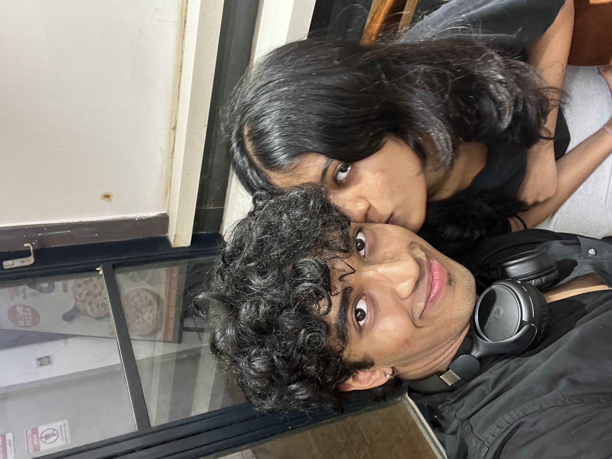
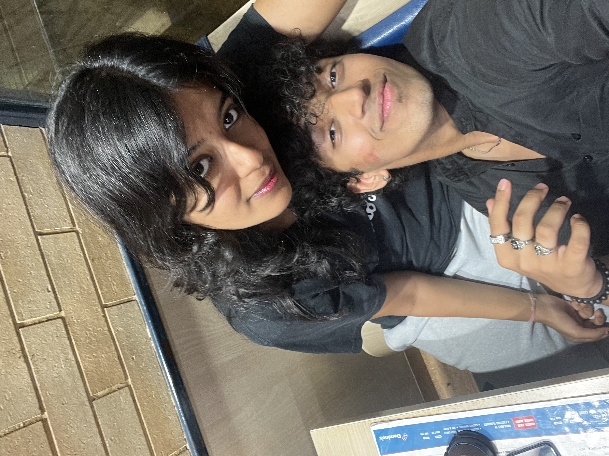

<!DOCTYPE html>  
<html lang="en">  
<head>  
<meta charset="UTF-8">  
<meta name="viewport" content="width=device-width, initial-scale=1.0">  
<title>For Aanya ❤️</title>  
  
</head>  
<body>  

  
<h2>Aanya 💗</h2>  

Do you want to see something special?
  
  
YES  
NO  
  

  

  
<h1>I LOVE YOU FOREVER AANYA 💗</h1>  

  

  

  
  
  
  
  
  

  

  

  
<audio autoplay loop>  
<source src="music.mp3" type="audio/mp3">  
</audio>  

  
  
</body>  
</html>  
